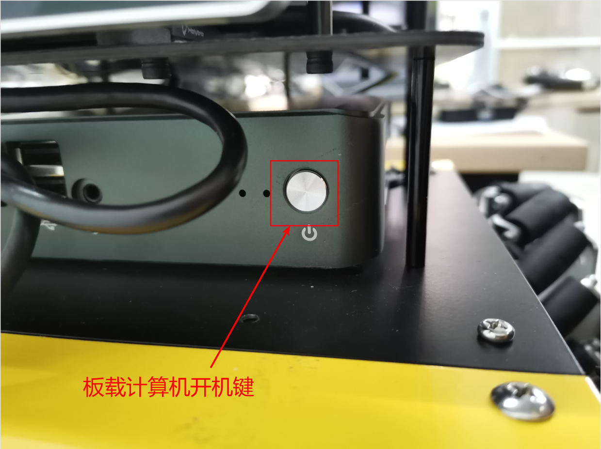
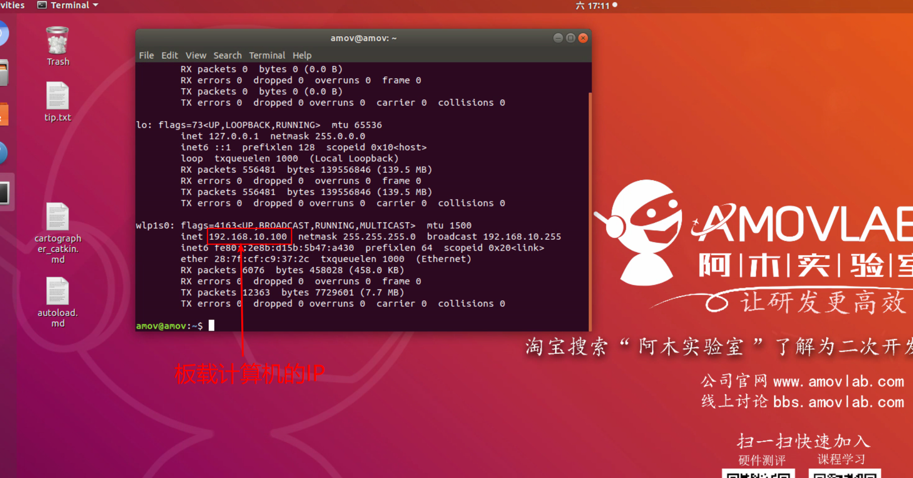
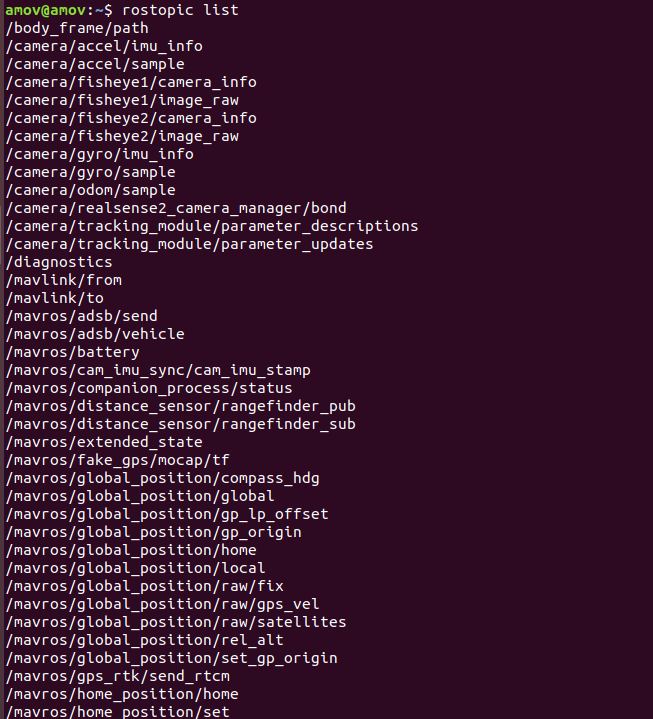
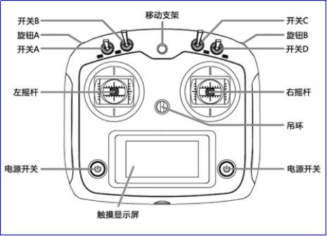
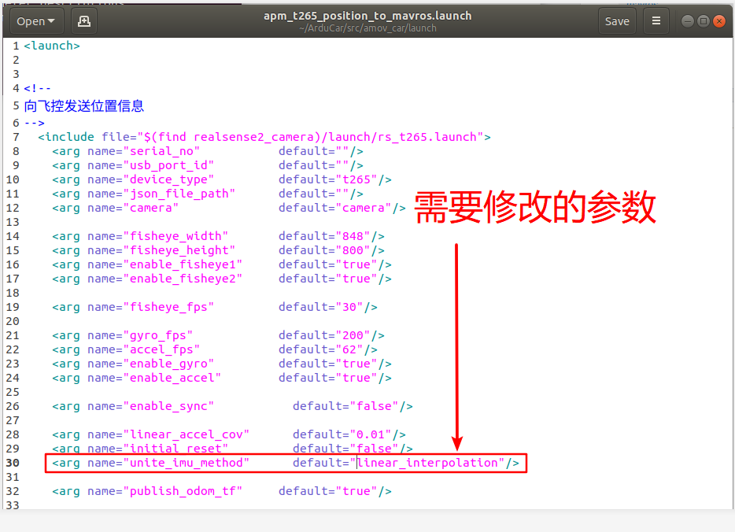

====================================
仿真系统与真机切换实践
====================================

1.1 真机系统框架介绍
=========================

硬件系统
-------------------

硬件系统主要包含小车车身，电机，车轮，保险杠，电池等硬件，具有以下优点：

①前后均配备有保险杠，有一定的防碰撞能力，能较好地保护车身及其他硬件，减少小车碰撞时的损坏。

②车身大部分硬件采用金属材质，结实耐用。

③车轮采用四轮驱动，动力更加充足，并且后轮采用麦克纳姆轮，转弯更加灵活，并且可以原地旋转。

④小车拥有悬挂系统，能保证小车更加平稳地运行，保证各种传感器数据更加精确，稳定。

飞控板
-------------------

飞控板主要负责控制小车的四个电机，并且搭载有IMU,RTK,GPS等传感器，可以与板载计算机和地面站进行通讯，接收下发的命令，上发一些小车状态数据，传感器数据等，飞控板还负责一些简单的功能应用的逻辑处理。

板载计算机
---------------------

搭载有ROS系统，主要负责小车上层应用以及算法的逻辑处理，规划等，例如slam，定位，避障，路径规划，视觉等功能。

1.2 ROS软件系统概述
=========================

ROS系统在前面已有说明，在这里主要说明一下在小车当中搭建的ROS软件系统框架

①模型
--------------

小车模型它的主要功能是提供小车各个硬件以及传感器之间的位置关系以及外型，物理属性等。对于仿真，模型可配合ros当中提供的控制插件以及gazebo可实现对小车的仿真，对于真机，模型主要是配合robot_state_publisher功能包，发布机器人重要传感器与机器人中心之间的tf关系，
例如激光雷达的数据中心是激光雷达的几何旋转中心，但这个中心位置往往并不是机器人中心，从而导致激光雷达数据会整体偏移，而这偏移量就是机器人中心与激光雷达中心的的距离，而tf恰好能弥补这一段偏移量，从而使激光数据能够正常使用。模型及tf更多内容请参考以下网址：

`ROS官网xacro介绍 <http://wiki.ros.org/xacro>`_

`ROS官网urdf介绍 <http://wiki.ros.org/urdf>`_

`ROS官网tf介绍 <http://wiki.ros.org/tf>`_

.. note::

        小车的模型文件位于ArduCar/src/simulation/models/amovCar下

.. image:: ../images/xacro.png

其中amovcar.xacro是小车整体的模型文件,rplidar_s1.xacro是雷达模型文件，d345i是相机模型文件，amovcar_robot.xacro是车身部分，meshs文件夹下存放的是
模型的外型文件。

.. note::

        小车的tf启动文件位于/ArduCar/src/amov_car/launch文件夹下

.. image:: ../images/tf_pub.png

其中的tf_publisher.launch就是发布tf的launch文件。

②mavros
----------------

mavros主要功能是连接飞控板与板载计算机，它会将飞控板的一些重要数据上发至板载计算机并以话题的形式发布到ROS当中，板载计算机对小车的控制指令也是
发布到mavros相应的控制指令接口。它是飞控板和板载计算机的重要纽带。

③上层功能应用
-----------------------

上层功能应用就属于小车的核心部分了，它主要是控制小车实现某一种具体的功能，例如slam，路径规划，避障等。在ROS当中集成了很多相关的功能包，可以去找寻相关资料
结合小车进行移植，也可以根据自己的需求设计算法，程序等。小车现在已经拥有cartographer_slam，rtabmap，VFH避障，Navigation等功能。

1.3 测试前准备操作
=========================

远程登录设置
----------------------

在机载计算机安装Mission Planner和TeamViewer工具，或者nomachion工具，或者SSH工具，可以远程桌面访问的工具很多。如果都是X86构架用TeamViewer最好，如果机载计算机有4G上网卡，那么公网访问也可以。
TeamViewer相关工具已经在文件夹里面。就是在局域网使用TeamViewer要配置下。如果使用ARM处理器的ubuntu系统的机载计算机，建议使用nomachion或者SSH ，SSH纯终端没有可视化界面，但是网络
带宽占用很少，适合在网络条件比较差的环境使用。

版本对应
----------------

飞控版本：V4.0.0

Mission Planner版本:：V1.3.67

Ubuntu版本：18.04

ROS版本：melodic

1.4 真机检查
=========================

在使用ArduCar真机前，需要检查ArduCar小车是否能能够正常运行，首先检查硬件设备是否正确连接。

确定相机传感器，激光雷达传感器和飞控板能够正确连接到板载计算机上。

.. image:: ../images/serial_1.png

.. image:: ../images/serial_2.png

接下来就可以启动ArduCar检查软件部分，但需要注意电量，电量过低将导致一些设备无法正常使用，例如wifi无法正常连接；相机，雷达等传感器无法启动。
确保电量充足的情况下，按下ArduCar电源开关以及板载计算机开机键。

.. image:: ../images/power_1.png

启动之后，可以通过远程连接板载计算机，或者直接将显示器和键盘鼠标接入板载计算机检查软件部分是否正常，首次使用建议接入显示屏鼠标键盘查看ip以及检查软件是否正常。
板载计算机的用户名和密码默认都是amov，用户可根据自身情况自行修改。进入Ubuntu系统后，首先查看wifi连接是否正常，通常情况下会连入与ArduCar编号所对应的wifi。在ArduCar侧面会有标签，上面有对应的编号。

.. image:: ../images/tag.png

图片中的SN:AMOVP436820024为该ArduCar的编号，对应的wifi名为amov-uav20024,wifi密码为amov20024,根据编号后两位数字的不同，wifi名和密码都会相匹配的变化。
连接上wifi之后，打开终端，输入ifconfig命令查看ip

.. image:: ../images/wifi_name.png

ArduCar是会开机自动启动关于t265定位的launch文件，所以一开机就应该会有相应的话题，使用rostopic list命令查看是否有相关话题。

再使用rostopic echo /mavros/vision_pose/pose命令查看t265定位数据是否正常刷新

.. image:: ../images/pose.png

当飞控板与板载计算机没有正常连接时，t265定位的launch文件会启动失败，从而影响板载计算机的启动，板载计算机启动时间会明显增加，并且开机后使用rostopic list会没有话题出现，可以通过使用以下命令检查问题:

::

        $ cd ArduCar
        $ ./t265_autoload.sh

通过终端打印的相关错误信息解决该问题。

    
1.5  室内ArduCar测试
========================

- 按下小何电源按钮以及板载计算机开机键，启动ArduCar

- 启动遥控器，保证小车能正常运行

.. image:: ../images/joy.png

- 远程计算机连接到ArduCar的wifi

- 启动Mission Planner连接到飞控端

.. image:: ../images/MP_1.png

端口号为6000

.. image:: ../images/MP_port.png

- 启动NoMachine等远程连接工具

板载计算机的ip一般情况为192.168.10.100，以之前查看的ip为准，用户名和密码均为amov

.. image:: ../images/NM_amov.png
.. image:: ../images/NM_1.png

- 启动相关脚本测试相关功能

首先进入sh脚本文件夹下

::

        $ cd /ArduCar/src/amovcar/sh

.. image:: ../images/sh_1.png

查看一下可运行的脚本

::

        $ ls

.. image:: ../images/sh_2.png

- apm_vfh.sh

::

        $ ./apm_vfh.sh

输入该命令即可启动vfh避障功能，该功能需要激光雷达传感器。在Mission Planner中规划相应的航点，将遥控器切为guide模式，ArduCar便可自动移动到航点位置并避障，但尽量在较为简单的环境测试该功能，复杂环境中，计算机无法快速处理障碍物信息从而影响避障效果。

.. image:: ../images/vfh_sh.png

.. image:: ../images/guide.png

cartographer_slam
----------------------------

::

        $ ./cartographer_slam.sh

输入该命令即可启动cartographer建图功能，该功能需要激光雷达传感器。使用rviz可查看地图，使用遥控器控制ArduCar移动，可建立完整的地图。
地图效果根据环境，cartographer算法的参数和激光雷达的不同，效果也是不一样的，建图时尽量使ArduCar以较慢的速度移动，从而保证地图的准确性。

.. image:: ../images/slam_sh_1.png

.. image:: ../images/slam_sh_2.png

apm_vfh_slam.sh
---------------------------

::

        $ ./apm_vfh_slam.sh

输入该命令即可同时启动cartographer建图和vfh避障功能。

.. image:: ../images/slam_vfh_sh.png

rtabmap
--------------

::

        $ ./rtabmap.sh

输入该命令即可启动三维建图功能，该功能需要t265传感器和D435i传感器。

.. image:: ../images/rtabmap.png

建图效果：

.. image:: ../images/3D_map.png

navigation
--------------

::

        $ ./

1.6  简单应用例程
========================

cartographer融合t265imu数据进行建图
----------------------------------------------------------

首先要对cartographer以及t265做一个简单的了解

在我们小车上已经有了cartographer建图功能，但没有融合imu数据，查阅cartographer官方文档后，获取了融合imu的具体方法。

`cartographer_wiki <https://google-cartographer-ros.readthedocs.io/en/latest>`_

cartographer会接收名为imu话题中的数据，数据类型为sensor_msgs/Imu

.. image:: ../images/imu_wiki.png

.. image:: ../images/imu_lua_1.png

.. image:: ../images/imu_lua_2.png

如图所示，在我们的模型当中已经预留了imu_link，名为amovCar/imu_link,所以修改方法为将tracking_frame改为 amovCar/imu_link，将TRAJECTORY_BUILDER_2D.use_imu_data参数设为true，

现在cartographer部分的修改已经结束，回到cartographer_ws工作空间下，编译一下，注意，这里的编译只能用cartographer提供的编译命令进行编译

.. note::

        $ catkin_make_isolated --install --use-ninja

接下来需要查看t265的imu数据，通过查阅t265相关的资料发现，t265发布imu数据格式需要修改一个参数，这个参数的修改位置位于ArduCar/src/amov_car/launch文件夹下的apm_t265_position_to_mavros.launch文件中，
找到uniti_imu_method参数，将参数值改为linear_interpolation或copy，t265的驱动便会向/camera/imu发布消息类型为sensor_msgs/Imu的数据。

但它的frame_id为t265相机的frame_id，因此我们需要将这个数据做一个转换。
我们需要写一个节点，接收/camera/imu话题中的数据，将数据的frame_id改为amovCar/imu_link之后再发布到imu话题中。这里我们采用c++写了一个ros节点，程序内容如下：

.. image:: ../images/imu_pub.png

现在t265和cartographer都已经配置完毕，还需要配置amovCar/imu_link的物理位置，先说明一下小车的坐标系，小车的空间直角坐标系为右手坐标系，小车前进的方向为X轴，也就是食指指向的方向，
中指指向Y轴方向，也就是小车的左方，大拇指的方向指向Z轴，也就是小车的上方。因为t265的imu数据位置来源于t265相机摆放的位置，根据t265的实际摆放位置就可以确定
imu_link的位置，小车高度为0.2675米，小车中心的高度为0.13375米，搭载t265相机的平板对角线交点就是小车的平面中心，根据这些数据就可以算出imu_link与base_link之间的tf关系，
经过测试，imu的方位角在X轴上旋转了90度，因此还要需要将imu_link旋转90度，在这里是以弧度为单位，所以90度大约为1.57。

.. image:: ../images/imu_link.png

配置完毕后，功能就配置好了，接下来就可以尝试启动该功能了。因为t265相机是自启动，所以我们只需要启动imu tf转换的节点和cartographer_slam.sh脚本即可

.. image:: ../images/imu_node.png

.. image:: ../images/node_graph.png

可以看到/camera/imu话题中的数据传递到/imu_publisher节点中，再发布到/imu话题中，cartographer_node再接收/imu话题中的数据就实现融合imu数据进行建图了。

