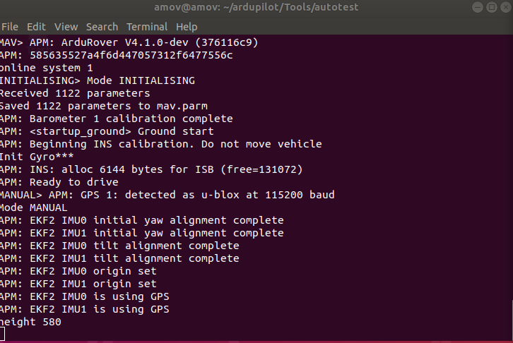
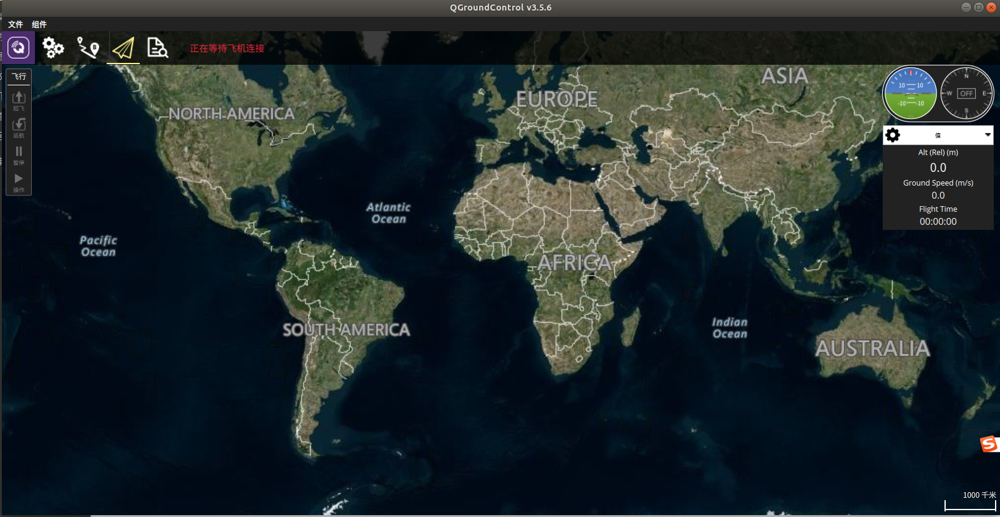

====================================
仿真系统软件介绍及其初步使用
====================================

1.1 软件安装
=========================

安装好的系统，没有浏览器,在使用之前可以安装好浏览器："wget https://dl.google.com/linux/direct/google-chrome-stable_current_amd64.deb",
然后安装"sudo dpkg -i google-chrome-stable_current_amd64.deb "。如果下载失败先"sudo apt-get uppdate",我们提供的百度网盘里面同时提供这些安装工具包。
在home目录下解压gazebo_models.zip。安装好VScode。安装一些常用的软件。一般都是下载deb软件包，然后采用"sudo dpkg -i" 命令安装软件。
系统的环境更新可以按照我们之前给PX4无人机的环境，这个环境里面Gazebo环境是好的，我们在这个环境基础上构建无人车的开发环境和源码。

1.2 代码更新和环境设置
=========================
提供的代码例子包含控制接口，激光雷达避障等，Mavros节点的无人车应用开发。项目地址为：http://gitea.amovlab.com/PrivateForAmovlab/ArduCar.git
提供的无人机仿真开发历程代码在github上，在使用之前先到远程库里面更新下代码，操作如下：

git  clone  http://gitea.amovlab.com/PrivateForAmovlab/ArduCar.git

如果下载不成功请到论坛发帖求助或者联系我们。

以下的环境代码配置在我们提供的ISO镜像基上首先确保可以正常安装使用了，在进行如下操作，具体教程请看https://bbs.amovlab.com/plugin.php?id=zhanmishu_video:video&mod=video&cid=18
这个无人机仿真教程的免费章节，如果上面链接失效，可以在我们铂贝学院里面找到。我们同时也会在文档资料里面提供。

- 打开~/ArduCar 源码目录，如果自己安装就去上述地址下载源码。

- catkin_make (ROS空间的常用编译命令,如果购买我们的硬件，我们是随机安装调试正常的)

- 编译完成目前的代码

- 拷贝ardupilot源码压缩文件到home目录,具体操作请看tar.gz 文件如何解压

- 把我们提供的.bashrc 文件替换有的.bashrc文件home目录按Ctrl+H ，显示隐藏文件就可以看到设置系统环境的文件.bashrc文件，然后替换掉，确保环境变量统一。

- git clone https://github.com/khancyr/ardupilot_gazebo

- cd ardupilot_gazebo

- mkdir build

- cd build

- cmake ..

- make -j4

- sudo make install

- 在源码里面设置为编译软件仿真 ，在ardupilot目录  ./waf configure --board sitl 

- ./waf rover 

- 安装MavProxy库：sudo pip2 install -U MavProxy

- 安装pymavlink库：sudo pip2 install -U pymavlink 

- 仿真环境搭建可以参考Ardupilot：https://ardupilot.org/dev/docs/using-gazebo-simulator-with-sitl.html

以上的安装因为网络原因不能保证可以正常安装，如果安装失败可以咨询我们，我们提供硬盘直接拷贝的服务，把系统直接拷贝到M2的硬盘中，客户拿到拷贝好的硬盘，插在系统M2的硬盘口上就可以直接进入系统运行
免去系统安装的繁琐，或者直接采购我们的板载计算机也可以直接使用。

机载计算机链接如下：
https://item.taobao.com/item.htm?spm=a230r.1.14.267.7eef3d8dVPMgte&id=611800776364&ns=1&abbucket=20#detail

硬盘链接如下：

1.3 代码软件框架及其仿真系统框架
=============================================

官方的文档仿真介绍：https://ardupilot.org/dev/docs/sitl-simulator-software-in-the-loop.html#sitl-simulator-software-in-the-loop

 .. image:: ../images/SITL.jpg

代码里面包含激光雷达模型，双目相机模型等等，自动驾驶等等，二维激光雷达避障，激光SLAM的例子，方便大家入手仿真开发。

1.4 启动开发环境
=========================

X86的机载计算机上提供一套完整的开发环境，我们用的ardupilot固件进行无人车的开发，ardupilot提供一套完整的无人车底层控制仿真代码，可以在ROS/Gazebo上运行。在系统用户目录的
ardupilot/Tools/autotest/sim_vehicle.py，这个文件就是启动了在PC中运行的一套无人车底层控制系统，这套控制系统中包含了完整的导航滤波，状态估计，PID控制算法。但是不包含视觉环境感知
和高级路径规划的模块。这些模块在机载电脑ROS里面完成。
- 启动软件仿真模块
在~/ardupilot/Tools/autotest/路径中的sim_vehicle.py启动命令如下：

- ./sim_vehicle.py -v APMrover2

运行一段python的代码，启动Ardupilot固件的无人车仿真程序

在打印消息中已经有了系统信息和初始化完成信息。

.. image:: ../images/sin_apm2.png

这个端口显示一些仿真的消息。

打开已经安装好的QGC地面站可以看到，无人车系统已经可以正常通过Mavlink消息链接。说明仿真的ardupilot无人车系统已经启动成功。

.. image:: ../images/apm_qgc.png

可以像操作真实无人车那样给无人车规划航点，控制无人车的运行，即便没有真实的无人车设备也可以在电脑上操作开发无人车系统。开发完成之后的代码可以切换到真实的设备上，一样效果运行。

1.5   无人车地面站规划模拟航线运行
================================================

首先安装QGC地面站，在我们提供的工具包里面有。

- sudo usermod -a -G dialout $USER

- sudo apt-get remove modemmanager -y

- sudo apt install gstreamer1.0-plugins-bad gstreamer1.0-libav -y

- chmod +x ./QGroundControl.AppImage

- ./QGroundControl.AppImage  (or double click)

运行成功

1.6  GUIDE模式自动驾驶
=========================================

用python给出了，该小车的位置控制Demo和速度控制Demo，这个pyton接口可以适配大部分路径规划的应用。大部分路径规划算法，最终收敛都是给无人车的执行机构发送期望的速度或者期望的位置。
在仿真中：

 - 启动Ardupilot仿真模块 在~/ardupilot/Tools/autotest/路径中的sim_vehicle.py启动命令如下：./sim_vehicle.py -v APMrover2

 - 新打开一个终端启动Mavros模块,Gazebo仿真模块：roslaunch simulation rover_apm.launch

 - 在Tools文件夹里面打开QGC地面站

 - 在~/ArduCarROS/src/simulation/scripts/目录中可以看到给无人车用的两条命令AutoCarapm_location.py和AutoCarapm_vel.py,一个是给无人车发送期望的位置接口，一个是个无人车发送期望的速度接口。

